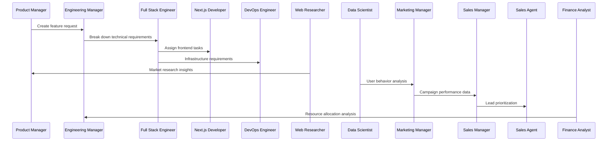

# AI Enterprise Framework

## Product Requirements Document (PRD)

### Overview
The AI Enterprise Framework is a distributed, cloud-native system designed to orchestrate multiple AI agents that collaborate and communicate through enterprise messaging platforms. The system simulates a complete enterprise environment where AI agents, each with specific roles and responsibilities, work together 24/7 to accomplish business objectives through natural language interactions. These agents can generate goals, create tasks for each other, and collaborate just like human employees in a real company.

### Agent Roles and MCP Integration

#### Technical Team
1. **Next.js Developer**
   - Frontend development tasks
   - UI/UX implementation
   - Component optimization
   - Performance monitoring
   **MCP Tools:**
   - Code generation tool
   - Component library tool
   - Performance testing tool
   - NPM package analyzer
   **MCP Resources:**
   - Component templates
   - UI/UX patterns
   - Performance benchmarks

2. **DevOps Engineer**
   - Infrastructure management
   - Deployment automation
   - System monitoring
   - Security implementation
   **MCP Tools:**
   - Infrastructure provisioning tool
   - Security scanner
   - Log analyzer
   - Performance profiler
   **MCP Resources:**
   - Infrastructure templates
   - Security policies
   - Monitoring configurations

3. **Full Stack Engineer**
   - End-to-end feature development
   - API design and implementation
   - Database optimization
   - Technical documentation
   **MCP Tools:**
   - API generator
   - Database schema analyzer
   - Documentation generator
   - Code quality checker
   **MCP Resources:**
   - API templates
   - Database schemas
   - Code standards

4. **Engineering Manager**
   - Technical leadership
   - Code review coordination
   - Sprint planning
   - Resource allocation
   **MCP Tools:**
   - Sprint analyzer
   - Resource optimizer
   - Code review prioritizer
   - Technical debt assessor
   **MCP Resources:**
   - Project templates
   - Review guidelines
   - Sprint metrics

#### Business Team
1. **Product Manager**
   - Product strategy
   - Feature prioritization
   - User story creation
   - Stakeholder communication
   **MCP Tools:**
   - Feature prioritization analyzer
   - User story generator
   - Market opportunity assessor
   - Roadmap optimizer
   **MCP Resources:**
   - Market data
   - User feedback
   - Competition analysis

2. **Finance Analyst**
   - Budget analysis
   - Cost optimization
   - Financial forecasting
   - Resource allocation analysis
   **MCP Tools:**
   - Budget analyzer
   - Cost prediction model
   - Resource allocation optimizer
   - Financial report generator
   **MCP Resources:**
   - Financial templates
   - Market indicators
   - Cost benchmarks

3. **Sales Agent**
   - Lead generation
   - Customer communication
   - Deal progression
   - Pipeline management
   **MCP Tools:**
   - Lead scorer
   - Email composer
   - Deal analyzer
   - Customer profiler
   **MCP Resources:**
   - Email templates
   - Sales scripts
   - Customer profiles

4. **Sales Manager**
   - Sales strategy
   - Team performance analysis
   - Pipeline optimization
   - Revenue forecasting
   **MCP Tools:**
   - Pipeline analyzer
   - Revenue predictor
   - Team performance optimizer
   - Strategy effectiveness analyzer
   **MCP Resources:**
   - Sales benchmarks
   - Performance metrics
   - Strategy templates

5. **Marketing Manager**
   - Marketing strategy
   - Campaign planning
   - Brand management
   - Performance analysis
   **MCP Tools:**
   - Campaign analyzer
   - Content effectiveness scorer
   - Brand sentiment analyzer
   - ROI calculator
   **MCP Resources:**
   - Campaign templates
   - Brand guidelines
   - Market trends

#### Research Team
1. **Web Researcher**
   - Market analysis
   - Competitor research
   - Trend identification
   - Data collection
   **MCP Tools:**
   - Web scraper
   - Trend analyzer
   - Competitor monitor
   - Data aggregator
   **MCP Resources:**
   - Research databases
   - Industry reports
   - Market indicators

2. **Data Scientist**
   - Data analysis
   - Predictive modeling
   - Performance metrics
   - Insight generation
   **MCP Tools:**
   - Data modeling tool
   - Pattern recognition engine
   - Statistical analysis tool
   - Visualization generator
   **MCP Resources:**
   - Dataset collections
   - Model templates
   - Analysis frameworks

### Agent Collaboration Example



### Goals
- Create a scalable, resilient platform for deploying AI agents in enterprise environments
- Enable seamless agent-to-agent communication through popular enterprise platforms (Slack/Discord)
- Provide robust monitoring, logging, and management capabilities
- Ensure high availability and fault tolerance
- Support easy configuration and deployment of new agents
- Maintain enterprise-grade security and compliance standards

### MCP Server Architecture

#### Core MCP Servers

1. **Development Tools Server**
   ```yaml
   server_name: dev-tools
   tools:
     - code_generator
     - performance_tester
     - security_scanner
     - api_designer
   resources:
     - code_templates
     - security_policies
     - api_specifications
   ```

2. **Business Intelligence Server**
   ```yaml
   server_name: bi-tools
   tools:
     - market_analyzer
     - revenue_predictor
     - customer_profiler
     - campaign_optimizer
   resources:
     - market_data
     - revenue_models
     - customer_segments
   ```

3. **Research and Analytics Server**
   ```yaml
   server_name: research-tools
   tools:
     - web_scraper
     - trend_analyzer
     - data_modeler
     - insight_generator
   resources:
     - research_databases
     - trend_reports
     - analysis_templates
   ```

### Technical Architecture

### Analytics Integration

#### PostHog Integration
1. **Data Collection**
   - Event tracking across user interactions
   - Custom event properties for detailed analysis
   - Automatic session recording
   - Feature flag states tracking

2. **Analytics Endpoints**
   - Public POST endpoints for event capture
   - Private endpoints for data querying
   - Trend analysis API integration
   - User behavior pattern detection

3. **Decision Making Capabilities**
   - Real-time usage metrics
   - A/B testing results
   - User flow analysis
   - Feature adoption rates
   - Conversion funnel insights

4. **Agent Data Utilization**
   - Product Manager: Feature adoption metrics
   - Marketing Manager: Campaign performance data
   - Sales Manager: Conversion analytics
   - Engineering Manager: Performance metrics
   - Data Scientist: Trend analysis and predictions

### System Architecture

#### Core Components

1. **Goal and Task Management**
   - Autonomous goal generation
   - Task creation and assignment
   - Priority management
   - Progress tracking
   - Cross-functional coordination

2. **Agent Runtime Environment**
   - Node.js-based containerized environments for each agent
   - Built-in memory management and context preservation
   - State management and persistence layer
   - Error handling and automatic recovery

2. **Agent Communication Hub**
   - Message broker for inter-agent communication
   - Protocol adapters for Slack and Discord
   - Message queuing and routing system
   - Event sourcing and replay capabilities

3. **Orchestration Layer**
   - Agent lifecycle management
   - Load balancing and scaling
   - Health monitoring and diagnostics
   - Configuration management

4. **Management Interface**
   - Web-based dashboard
   - Agent deployment and configuration
   - Performance monitoring
   - Audit logging

#### Agent Architecture

```
┌─────────────────────┐
│     Agent Core      │
├─────────────────────┤
│  - Context Manager  │
│  - Memory Store     │
│  - Task Processor   │
│  - Comms Interface  │
└─────────────────────┘
         │
         ▼
┌─────────────────────┐
│  Message Protocol   │
└─────────────────────┘
         │
         ▼
┌─────────────────────┐
│ Platform Adapters   │
│ (Slack/Discord)     │
└─────────────────────┘
```

### Communication System

#### Collaboration Patterns
1. **Goal-Based Interaction**
   - Agents can autonomously generate business goals
   - Goals are broken down into actionable tasks
   - Tasks are assigned based on agent capabilities
   - Progress is tracked and reported

2. **Cross-Functional Collaboration**
   - Technical and business agents work together
   - Research insights inform decision-making
   - Continuous feedback loops
   - Resource optimization

#### Message Protocol
- JSON-based message format
- Required fields: sender_id, recipient_id, message_type, payload, timestamp
- Support for synchronous and asynchronous communication
- Built-in message validation and schema enforcement

#### Platform Integration
1. **Slack Integration**
   - Bot User OAuth integration
   - Channel-based communication
   - Thread support for context preservation
   - File sharing capabilities

2. **Discord Integration**
   - Bot application with required intents
   - Server-based communication
   - Channel categories for different agent types
   - Rich embed support for structured data

### Deployment and Scaling

#### Infrastructure Requirements
- Kubernetes-based deployment
- Auto-scaling based on load
- Multi-region support
- High availability configuration

```
┌─────────────────────────────────────────┐
│            Load Balancer                │
└─────────────────────────────────────────┘
              │
              ▼
┌─────────────────────────────────────────┐
│         Kubernetes Cluster              │
│  ┌─────────────┐  ┌─────────────┐      │
│  │ Agent Pod 1 │  │ Agent Pod 2 │  ... │
│  └─────────────┘  └─────────────┘      │
└─────────────────────────────────────────┘
              │
              ▼
┌─────────────────────────────────────────┐
│         Persistent Storage              │
└─────────────────────────────────────────┘
```

### Security and Compliance

1. **Authentication and Authorization**
   - OAuth 2.0 implementation
   - Role-based access control
   - API key management
   - JWT token-based authentication

2. **Data Security**
   - End-to-end encryption for sensitive data
   - Data retention policies
   - Audit logging
   - Compliance with GDPR and SOC 2

### Implementation Roadmap

#### Phase 1: Foundation (Months 1-2)
- Basic agent runtime environment
- Simple Discord/Slack integration
- Core message protocol
- Basic deployment scripts

#### Phase 2: Scale (Months 3-4)
- Kubernetes deployment
- Auto-scaling implementation
- Enhanced monitoring
- Message persistence

#### Phase 3: Enterprise Features (Months 5-6)
- Management dashboard
- Advanced security features
- Compliance implementations
- Documentation and training

### Technical Requirements

#### Development Stack
- Runtime: Node.js 18+
- Container: Docker
- Orchestration: Kubernetes
- Database: MongoDB
- Message Queue: RabbitMQ
- Cache: Redis

#### Minimum System Requirements (Per Agent)
- CPU: 1 vCPU
- Memory: 2GB RAM
- Storage: 10GB
- Network: 100Mbps

### Monitoring and Maintenance

1. **Metrics Collection**
   - Agent performance metrics
   - Message throughput
   - Error rates
   - Response times

2. **Alerting**
   - Resource utilization alerts
   - Error rate thresholds
   - Agent health status
   - Platform integration status

### Configuration Management

```yaml
# Example agent configuration
agent:
  id: "agent-001"
  role: "next-js-developer"
  capabilities:
    - frontend-development
    - react
    - typescript
    - performance-optimization
  memory:
    type: "redis"
    retention: "24h"
  communication:
    platforms:
      - type: "discord"
        channelId: "123456789"
      - type: "slack"
        channelId: "987654321"
  scaling:
    min: 1
    max: 5
    targetCPU: 80
```

### Analytics-Driven Decision Making

#### Automated Analysis Workflow
1. **Data Collection Phase**
   ```mermaid
   graph TD
       A[Event Capture] --> B[Data Processing]
       B --> C[Metrics Generation]
       C --> D[Pattern Recognition]
       D --> E[Insight Distribution]
   ```

2. **Decision Flow**
   - Continuous metric monitoring
   - Threshold-based alerts
   - Automated report generation
   - Cross-functional insight sharing
   - Action item creation

3. **Example Use Cases**
   - Feature prioritization based on usage patterns
   - Resource allocation using performance metrics
   - Sales strategy adjustment from conversion data
   - Marketing campaign optimization
   - Technical debt prioritization

### Future Considerations
- Integration with additional messaging platforms
- AI model fine-tuning capabilities
- Advanced analytics and reporting
- Custom agent development SDK
- Multi-tenant support
- Edge deployment options

### Contributing
Contributions are welcome! Please read our contributing guidelines and code of conduct before submitting pull requests.

### License
This project is licensed under the MIT License - see the LICENSE file for details.
